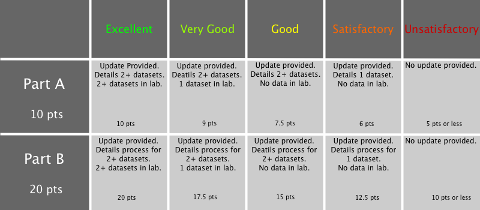

Lab 1: Finding/Working with (Open) Spatial Data
===============================================

Ryan Mullins | [RyanMullins@psu.edu](mailto:RyanMullins@psu.edu)

# Overview

Lab 1 serves as the jumping off point for all of the following labs, so let us lay out exactly what you will be making in these labs. The goal of these three labs is to teach you the skills needed to make a web map. The map you will be making is a modification to the [Fire Map](http://www.personal.psu.edu/rsm5068/spring2013/geog461w/HMW/map.html) created by Sarah Hanson, Anthony Marze, and Jessica White in the Spring 2013 edition of Geog 461W. Your role is that of a cartographer creating an interactive visualization that allows fire fighters to look at forest fire activity in Alaska. The Hanson et. al. Fire Map sought to identify temporal patterns in western US forest fires, therefore acting as a predictive analysis tools. Your map will be different. Rather than worry about predicting where and when fires will occur, your map will be a tool that helps fire fighters identify key resources and infrastructure that could be used in their response to forest fires. Before you can begin to make a map, you need spatial data to put on the map. 

In lab 1 you will learn what spatial data is, where to find it, and how to prepare it for use in your Fire Map. Lab 1 covers the following topics. 

1. What is spatial data, who creates it, and how can we use it?
2. How do we get, store, and access spatial data?
3. How do we refine spatial data to make it easier to work with?

By the end of this lab you will be able to do the following tasks related to preparing data for use in a web map. 

1. Locate spatial data from a variety of online resources, and determine if and how this data can be used.
2. Download, refine, and format data to be compatible with various web mapping technologies.

# 1 (Open) Spatial Data

You are probably familiar with the term data. Another term you are probably very familiar with is information. These terms are often used interchangeably, and in most situations that's perfectly okay. But, for the sake of clarity in these labs, we will define a difference between data and information. [Data](http://en.wikipedia.org/wiki/Data) is the raw quantitative and/or qualitative values the describe something. [Information](http://en.wikipedia.org/wiki/Information) is data viewed in a context so that it can be interpreted to have meaning. Information is made up entirely of data, but individual pieces of data are not necessarily information.

So what does this mean in terms of these labs? These labs are instructional tools designed to teach you some of the basic skills to find spatial data, provide a context that turns that data into information, and present that information to an audience so that they can gain knowledge. This lab focuses on how to find and prepare spatial data, so that it can be given a context and presented in map form in later labs. 

Spatial data, in it's most general form, is expressed as coordinates that locate a position or set of positions in space. Spatial data is extremely diverse and widely available. Unfortunately, this can also be a problem. There are many competing formats for storing spatial data. Some of these formats are open, meaning the standard is freely available for you to examine and understand, while other are proprietary, either being owned by a private industry, classified by a government, or just simply obfuscated beyond comprehension. Aside from format, one of the biggest challenges in obtaining spatial data is licensing. Much like music, movies, and software in the US, data can also be licensed to either permit or prohibit the use of the data by entities besides the one(s) that created it. Once you have permission to use the data and understand the format that the data is in, the final hurdle is understanding how to store and access this data. Below is a short discussion on each of these topics.

## 1.1 Data Formats

Spatial data comes in many formats. You are probably familiar with some of the more common formats &mdash; Shapefiles, GeoTIFFs, DEMs, etc. You are probably also aware that different formats are used to store different types of spatial data. The short list provided previously covers vector, raster, and gridded data types. What you may not be aware of is that the formats used by traditional desktop GIS software are not necessarily the same formats used for web applications. Below is a brief discussion of the difference between the types of formats used in geospatial web applications, and the different typesof data these formats are used for. 

A major distinction to draw is between the types of formats used in web applications. Formats can be either human readable or not human readable (binary). The difference between these types of formats is obvious, one you can just see and understand and the other you cannot. The most popular human readable formats used in web applications are [JSON](http://www.json.org/) (JavaScript Object Notation), [XML](http://www.w3.org/XML/) (eXtensible Markup Language), and [CSV](http://en.wikipedia.org/wiki/Comma-separated_values) (Comma Separated Values, tabular). Each of these formats can also be used to store spatial information. JSON and XML have special sub-formats, [GeoJSON](http://geojson.org/geojson-spec.html) and [KML](https://developers.google.com/kml/documentation/) respectively, that are designed to explicitly handle spatial information, whereas with CSV files you simply add columns for latitude and longitude or a string that defines a polygon. The most popular non-human readable formats are typically images and video, things like PNGs, TIFFs, and GIFs. The biggest advantage to human readable formats is the ease of understanding structure and even validating that they are formatted correctly (on smaller files). This is also the cause of their biggest downfall. With all of the contents of these files being stored in text, the size of these files is larger than it might be with binary files, which is a concern where bandwidth is limited (i.e. mobile, rural areas, etc.). 

Now that you know what data formats you might encounter, what types of data do these formats generally conceal. GeoJSON, KML, and CSV are all well suited for storing vector data, as well as storing all of the metadata associated with these geometries. The common binary formats are designed to store images and video. These images can be a wide variety of things, but one of the most important uses is the store the images used as tiles in most web maps. You will learn more about this in Lab 2. 

## 1.2 Data Licensing

Licensing is a difficult and complex subject to cover. The short version is that copyright law in the United States is a terribly complex and abused system that needs to be completely overhauled, but will not be anytime soon. So, we as cartographers and developers must ensure that the data we are using is licensed properly, and used within the terms of those licenses. Luckily, there is some hope. 

Spatial data, and any other form of intellectual property, can be copyrighted the moment it its created. Fully copyrighted data may not be used by anyone but the copyright holder (an individual, corporation, or otherwise) without expressed permission. There are two exceptions to this. First, are the works and data contained in the public domain. Data enters the public domain if the creator forfeits the right to copyright protections, or the statue for copyright protection expires. Second is the use of an Open Data license, like the Open Database License. By using these types of licenses, you are granting universal permission to use the data on two conditions: (1) all works that use this data must make it available for others for others to also use; and (2) all works that use this data must attribute its origin to the original creator. When data is licensed under these terms it is considered open data. For information on how to license your own data using an open data license, see the [Open Data Commons](http://opendatacommons.org/guide/).

## 1.3 Data Storage and Access

Data can be large or small, complex or simple, structured or unstructured. How you choose to store and access data can have far reaching impacts on the performance and usability of your applications. The methods you choose to employ for storing and accessing data are often driven by the size of your data. For smaller datasets you can get away with storing it in individual files on your local machine. This is how you will be storing the data you use in this lab. Storing a a few smaller JSON or CSV files directly on your web server, then loading all the data into your application at once will not be a problem. 

Loading all of the data into an application at once does become a problem when there is a large amount of data. If you have millions or billions of data points, it is nearly impossible to store them all in memory. Instead, you make use of a database. Databases are a diverse set of technologies designed to make storing, managing, querying, and accessing data easier. In modern web applications, databases are accessed using web services, which provide [application programming interfaces](http://en.wikipedia.org/wiki/Application_programming_interface) that allow you to request, query, and manipulate data in a database using an HTTP connection. This topic is not covered in the scope of this course or these labs. 

# 2 Online Data Sources

The internet has revolutionized the ways we generate and consume data. Spatial data is now easily available with a simple click of the mouse, and you can find new and interesting datasets with a simple Google search. Below is a discussion of who is creating spatial data and where you can go to find it.

## 2.1 Government

Probably the largest creator and publisher of geographic information in the United States in the federal government. Everything from topography to hydrography to street addresses, the US government publishes data on every physical attribute under their jurisdiction. They are typically accurate and available at a variety of spatial resolutions. The only problem is that there is not a central repository of this data, yet. Check out the [USGS](http://www.usgs.gov/), the [National Park Service](http://www.nps.gov/index.htm), the [Bureau of Land Management](http://www.blm.gov/wo/st/en.html) for the bulk of your needs, thought the CIA, NGA, and State Department are known to be valuable sources too. 

## 2.2 Open Spatial Projects

In the last five years or so there has been a new model for creating and curating spatial data: open source collaborative projects. The two biggest players are the [Open Street Map](http://www.openstreetmap.org/#map=5/51.500/-0.100) project, a community that curates a dataset containing roadways, trails, locales, and more, and the [Natural Earth](http://www.naturalearthdata.com/) project, a community that curates the cultural and physical vector datasets along with raster imagery. Between these two sources you can make a base map for just about anything you can imagine. 

## 2.3 Social Media

Social Media may be a surprising source of spatial data, but it is. Twitter, Facebook, Nike+, and FourSquare produce millions and millions of spatially correlated data points each day. Social media data can be explicitly spatially referenced in its metadata, or spatial references can be inferred from the content of the data. The difficulty in using social media data is three fold: (1) it is typically quite large and hard to wrangle; (2) it can be hard to access, or limited in the amount you can access in a single day; and (3) if it is not explicitly spatially referenced, it can be incredibly hard to discern exactly what the content is referencing. 

## 2.4 Deliverable (Lab 1 Part A, 22 Jan 2014)

Now that we have had a chance to discuss what spatial data is and where it can be found, it is time for you to go out and actually gather some data. For your first deliverable, you will find at least two spatial data sets that can be used in your fire map. 

The first data set is the same for everyone. Use Google or another search engine to find the Federal Wildland Fire Occurrence Data, a dataset published by the United States Geological Survey. This dataset is a collection of every fire that has occurred in the United States between 1980 and 2012, including centroids and a considerable amount of metadata for each fire. The data is stored in a series of Shapefiles, one that aggregates reports from all federal agencies and then a file for each individual agency. You should download the "All agencies" file and save it on either your G:/ Drive or on your local machine (should you choose to use it). 

The choice of all other datasets I leave up to you. Remember what you are trying to make: a map that allows fire fighters in Alaska to see where fires have occurred in the past and identify the location of resources and infrastructure that can be used to help fight future fires in an area. Try to find spatial data that is available in a commonly used format, i.e. Shapefiles, CSV, KML, (Geo)JSON, etc. Some suggestions of the types of data to look up below.

* Boundaries for the Geographic Area Coordination Center and Fire Management Zones
* Hydrology data (oceans, lakes, rivers, etc.)
* Roadways and infrastructure (airports, ports, etc.)
* Topography data

Once you have found and downloaded your data, submit a short update to the Lab 1 Part A dropbox on [Angel](http://cms.psu.edu). In the update tell me about each data set you have downloaded, including the name and a link to where it can be found. Please bring your data to class with you on Wed 22 Jan 2014, I will be walking around to see what each of you have found, we will also be working with this data to make it easier to use.

_Note: You may use Natural Earth and Open Street Map data as this deliverable. If you do, don't worry about downloading anything._

Grading information can be found in Section 4. 

# 3 Making the Data Usable

Now you have some data to map. Now it is time to inspect this data and determine if it's ready to be mapped out of the box, or if you need to work with it a bit before mapping it. Preparing your data is generally a three-step process of cleaning, filtering, and formatting. 

Cleaning is the process of removing bad data points from the dataset. Bad data points happen, and removing them is just something that needs to be done. The trick is defining what qualifies as a bad data point, finding data that meets your criteria, and then finally removing it from the set. Common examples are things like duplicates, leftover test data from when the system was created, etc.

Filtering is similar to cleaning. The difference is that data that is filtered out is not bad, it just is not of interest to you. Maybe the dataset is too large, maybe you only want things in Alaska, maybe you only want data point from the last 10 years. Whatever your criteria are, filtering is a way to make the dataset more manageable and potentially more relevant to your audience. 

Formatting is the conversion from one file format to another. For the last 20 years, the primary format for a lot of spatial data was the Shapefile. Shapefiles (thankfully?) are not great for web mapping, so a bunch of tools have been created to convert Shapefiles into something more suitable for the web. 

Filtering and cleaning can often be done at the same time. You rely on tools like ArcGIS, GDAL, text editors, and others to accomplish cleaning and filtering tasks. Once they are complete then you can format the data, though sometimes you need to format your data between steps. Data preparation is an intricate and challenging process that can be a lot of fun, or a huge headache. 

## 3.1 Deliverable

The second and final deliverable for this lab is to refine and format your data so that you can make a map from it. Like Part A, Part B has two parts. 

First, there will be an in-class demonstration on how to use ArcGIS and a spreadsheet editor to clean, filter, and format data. This demonstration will use the USGS Federal Wildland Fire Occurrence Data, and you are encouraged to follow along. We will begin by using ArcGIS definition queries to filter out all but the fires that occurred in Alaska. We will then export this data to a CSV file and open it in a spreadsheet editor (Microsoft Excel) to clean out (remove) any bad data points (criteria to be defined during demonstration). 

Now that you have seen how cleaning, filtering, and formatting tasks can be done, clean, filter, and format the other dataset(s) you downloaded in Part A. For data that you plan to make interactive visualizations of, consider reformatting the data into either CSV or GeoJSON. If you believe that your data is sufficiently usable that's fine, but think of a way that the data could be improved. 

Submit an update to the Lab 1 Part B dropbox on Angel. In this update include the methods and criteria you used to clean, filter, and format each dataset. If you had a dataset that was sufficiently usable, include a short discussion (no more than 100 words) of problems that might occur in the data that would be solved by clean, filtering, or formatting. Bring your data with you to lab on 27 Jan 2014.

Grading information can be found in Section 4. 

# 4 Deliverables and Grading 

**Lab 1 Part A (22 Jan 2014)**

Find and download two or more datasets that can be used in your map. Submit an update to the Lab 1 Part A dropbox on Angel, including the name of each dataset and a link to where it can be found. Bring your data with you to lab on 22 Jan 2014.

**Lab 1 Part B (27 Jan 2014)**

Follow along with the in-class tutorial on working with the USGS Federal Wildland Fire Occurrence Data. Export a CSV file of the edited data from ArcGIS. Perform similar cleaning and filtering tasks on the dataset(s) you chose to download for Lab 1 Part A. Format these extra data so that they can be used in TileMill (Shapefille, CSV, XML) or parsed by a web page (CSV, JSON). Submit an update to the Lab 1 Part B dropbox on Angel detailing the cleaning, filtering, and formatting you have done on the data. Bring your data with you to lab on 27 Jan 2014.

**Grading**

