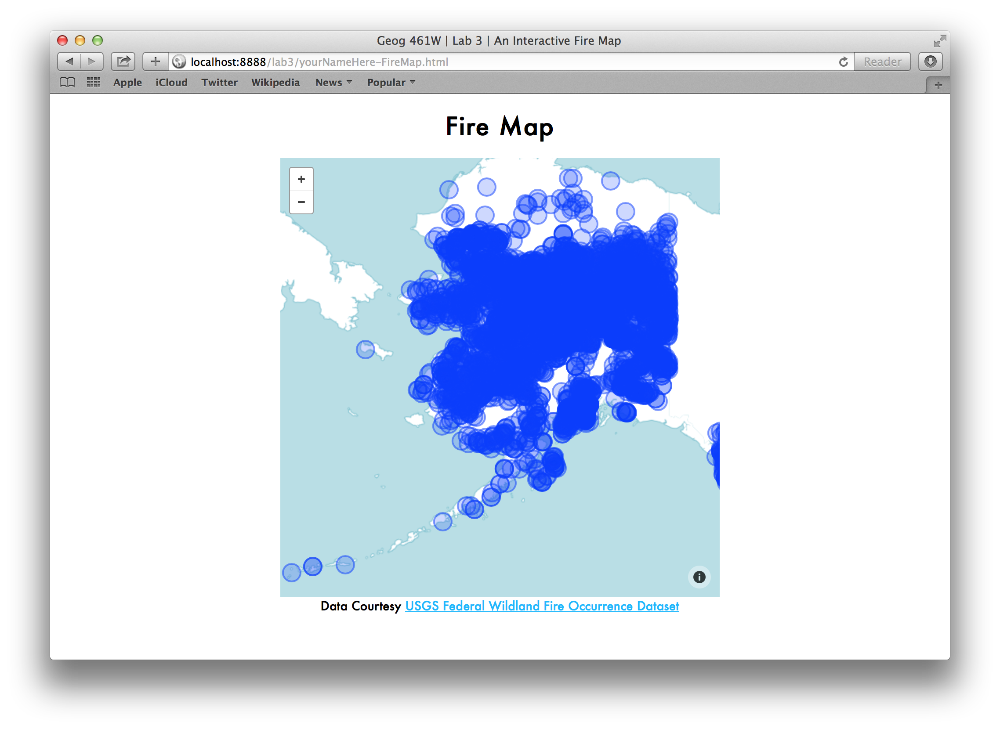
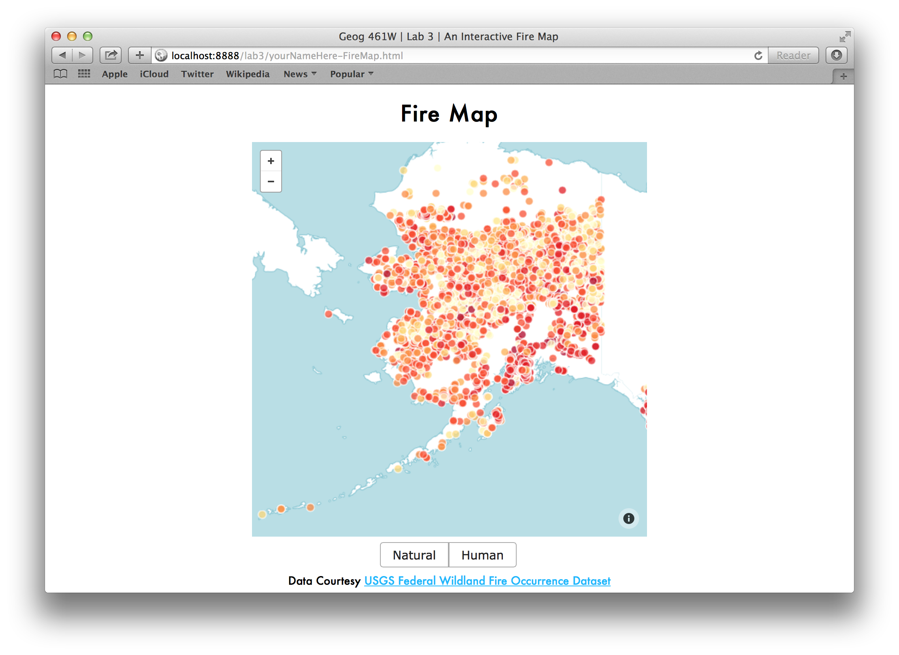
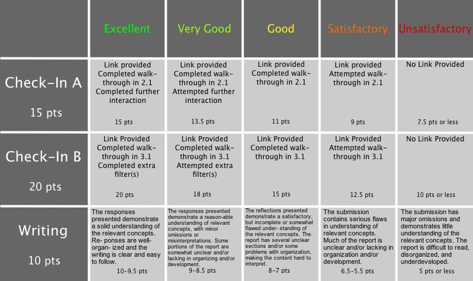

Lab 3: Customizing Appearance and Interactivity 
===============================================

Ryan Mullins | [RyanMullins@psu.edu](mailto:RyanMullins@psu.edu)

# Overview

Lab 3 builds on the map made in Lab 2, exploring another aspect of dynamic representation: interaction. This lab covers the following topics. 

1. The fundamentals of adding interactivity to a web map &mdash; how interactivity can be used to gain more information about the data, or to filter the data being displayed on the map;
2. Creating interactive map symbols that offer greater details about the features;
3. Creating interactive UI elements to control data filters.


# 1 Basics of Interactivity

This course explores the variety of ways that a map can be dynamic, or change representations based on various parameters. Maps are dynamic in one of two ways, either based on the input of the reader or without this input. In lectures you have seen, or will see, dynamic maps that change without user input. Non-interactive dynamic maps are, generally speaking, easier to make. There is less chance that a user will cause something to go wrong or force the application into a state that you had not foreseen when designing it. These maps tend to have a more limited or focused functionality than interactive maps. Though, this is not to say they have less ability to convey a message to a reader. 

Interactive dynamic maps are dynamic in that the representation changes based on input from a user. This could be direct interaction with elements of the map &mdash; direct manipulation of the symbology, manipulating the map extents, etc. &mdash; or indirect interaction &mdash; using controls in other portions of the UI to change the map. This increased variety and complexity of interaction also means that there are more chances that someone could do something that messes up the display or breaks the application. Therefore, it is extremely important to understand how you want someone to be able to interact with your maps, and how these interactions affect one another. 

In lab 2 you made a map that was, to a limited extent, interactively dynamic. This map offered users the ability to interact with it and change the zoom level and visual extent of the map using the functionality built into the Leaflet.js mapping library. In this lab you will build on this map, adding more interactivity. First, you will make the point symbols that represent the fires interactive, adding pop-ups with detailed information that appears when the user clicks on the marker. Then, you will add additional UI elements that allow users to filter which data is shown based on the value of the data's attributes.


# 2 Interactive Map Symbols

In this section we will look at interactivity in web maps beyond the standard panning and zooming features you get with most web mapping libraries today. We will start with a step-by-step walk-through of how to create interactive point symbols for the Alaska Fires dataset we have been using since Lab 1. Then We transition to interaction in other contexts, namely making interactive map tiles. 

## 2.1 Interactivity and Leaflet.js

### Step 1: Removing Fire Data From Tiles

This part is simple... Open up TileMill. Go to the project you created in Lab 2. Delete the Alaska fires layer that you made as part of the walk-through in Lab 2 Part A. Upload these tiles to MapBox. 

### Step 2: Loading Fire Data with jQuery

Now that we have a semi-clean slate (making sure that the other data layers that you put in your tiles are still there), you can start start the process of making interactive symbols for the fires using Leaflet's built in features. 

The first step here is to have your application load in the CSV data for the fires that we created in Lab 1. To do this, we are going to use [jQuery](http://jquery.com/). The core library allows you to find, change, add, or delete content displayed on a web page, load in resources from external pages, and make content on your pages respond to user interaction. jQuery also has a rich set of plug-ins, which handle most any interface feature you could want that isn't handled out of the box. 

Like most JavaScript libraries, jQuery is hosted as a static file somewhere on the internet, and can be used in your pages by including a script tag linking to this location. Below are two script imports that you should add to the header of your page, after the `<title>` and before the MapBox.js imports. The first imports the core jQuery library, hosted on the jQuery project's servers. The second imports the [jQuery CSV](https://code.google.com/p/jquery-csv/) plug-in, which is a fully [standards compliant](http://tools.ietf.org/html/rfc4180) CSV parser that I am hosting on my PSU Web Space. 

```HTML

<script type="text/javascript" src="http://code.jquery.com/jquery-1.10.2.js"></script>
<script type="text/javascript" src="http://personal.psu.edu/rsm5068/Geog461W_SP14/jquery.csv.js"></script>

```

With jQuery available, you can use it to load the _alaskaFires.csv_ file. This is done using the `.get()` function and is shown below. This function allows you to use an HTTP GET request to load a resource asynchronously from when the page loads (see Lab 0 Section 2.3 for an explanation of HTTP).

```JavaScript

$.get("AlaskaFires.csv", function (fireData) {
    console.log(fireData);
});

```

You may be familiar with the term [AJAX](http://en.wikipedia.org/wiki/Ajax_(programming)), which is the term describing the technologies and used to make asynchronous (caused by some interaction or other state change) requests. Here we used a method specific AJAX request to get data from a server and make that data available. Let's take a look at each piece of this code to see exactly what is happening. 

The first thing you will notice is the `$`. This is one of two ways to reference the jQuery library in your code (the other being to use `jQuery` but this is much faster to type). This may seem odd to you, but the `$` is one of a few select special characters that can be used as a variable name. 

Next you see the call to the `.get()` method. Like I mentioned previously, this is a convenience function that takes in two parameters. The first parameter is the path to the resource you want to load. The second parameter is a callback function, which I will explain shortly. When this function is called, jQuery creates an HTTP GET request that asks for the resource listed in the first parameter. An HTTP connection is established with a server and the server returns the requested resource to the client. When the jQuery client sees that it has received all of the data it asked for, it calls the function provided as the second parameter, hence the term callback because you are giving one function another function to come back to and call when it is done doing its thing. Inside the callback function I provided, there is just a logging statement that prints the data to the browser's console (see Lab 0 Section 4 for a discussion on how to access your browser's console). 

In your text editor, open up the HTML file you made for Lab 2 and paste the code above into the body `<script>` tag below the code that creates the map and sets its parameters. Save your work and publish your map and the _AlaskaFires.csv_ file to your PSU Personal Web Space like you did in Lab 2 (it might ask if it is okay to replace the existing map file, tell it yes). Next, open your browser and go to your map on your Personal Web Space. After the page loads, open the browser console, you should see a long output of all the data from the _AlaskaFires.csv_ file. If you do not see this output, go back and make sure your HTML file and data file are in the same directory on your PASS space, then make sure you copied the code from above into the correct location. If you have exhausted all other debugging possibilities come see me during office hours. 

### Step 3: Converting Data into Markers 

In this step we will convert this raw CSV data into point symbols. The code below does three things. First, it uses the jQuery CSV plug-in to convert the data you loaded in Step 2 into an array of JavaScript objects. Next, it uses the jQuery `.each()` function to go through each of the objects in the array returned by the jQuery CSV plug-in and execute a callback function that is passed the next object in the array. Finally, inside this callback function we use the Leaflet.js API to create markers and add them to the map. 

Start by copying this code, and replacing the body of the callback function from Step 2 with the code you just copied. Save your work and publish the update to your Personal Web Space. Reload the page in your browser. After about 2 seconds the map should appear with all of the points that you removed from the tiles, albeit in a much less visually appealing form (Figure 2.1 below). We will get to making these markers more visually appealing in Step 4. If you run into issues with the markers showing up, try your debugging techniques or come see me in lab.

```JavaScript

var fires = $.csv.toObjects(fireData);

$.each(fires, function (index, fire) {
    // ---- Making the Marker ----

    var fireMarker = L.circleMarker(L.latLng(fire.DLATITUDE, fire.DLONGITUDE));
    map.addLayer(fireMarker);
});

```

Let's take a look at the details of this code. On the first line you see we are creating a new variable called `fires`. This variable will eventually be an array of objects that we will use elsewhere, but we need to create that array first. 

The array is created using the jQuery CSV plug-in that you imported in Step 2. If you look at the syntax of this line you can begin to understand how jQuery plug-ins work. First you have the `$`, which is the full jQuery library. When you imported these libraries you imported the jQuery core library first, then imported the jQuery CSV plug-in. When this plug-in is first loaded, it takes the jQuery library and adds a new property `csv`, which includes several functions for parsing CSV data and turning it into JavaScript objects (or arrays). To make use of a function included with a jQuery plug-in you use this syntax: `$.plugInName.desiredFunction()`. In this code we want to use the `.toObjects()` function of the `csv` plug-in to convert the data into objects, so we end up with the following line of code: `$.csv.toObjects(fireData)`. The result of this code is then assigned as the value of the `fires` variable.

A bit more about the `.toObjects()` function. This function takes raw CSV data and converts it into an array of JavaScript objects. There is one object in the array for each row of the CSV file. Each object has a series of properties that hold the attributes for that piece of data. The names for these properties come from the first row in the CSV file, which by definition should be the header row containing the name of each column of data in the file. You can set two options with this function, `separator` and `delimiter`. The `separator` option tells the parser what kind of line ending to use to differentiate between lines in the file. By default this value is the Unix standard '\n' (or "newline") character, though you can change this if a dataset you are using has a different line ending. 

After making this array we use the jQuery each function to go through each fire object in the array and run a function that takes this object as a parameter. Colloquially you may hear this concept called "looping" or "iterating", I will use the term looping in this lab. So, each time the `.each()` function loops through the `fires` array it calls the function passed to it as the final parameter. Each time it executes this function, it passes the function an object representing a fire as a parameter, which I also decided to name `fire`. Inside the function we create a new variable, `fireMarker`, which is a Leaflet [CircleMarker](http://leafletjs.com/reference.html#circlemarker). CircleMarkers are a type of [Layer](http://leafletjs.com/reference.html#ilayer) in Leaflet, and a layer is any graphic object that can be attributed to a location on, and added to, the map. We use the _DLATITUDE_ and _DLONGITUDE_ attribute of the fire to define the center for each marker. Finally, we make use of the `map` variable we created in Lab 2, using its `.addLayer()` function to add the marker to the map. 



### Step 4: Customizing Marker Appearance

As you probably noticed in the image above, the new markers we made have the same problems they did when we first loaded them into TileMill &mdash; overly large and all one color. But, again, just like when we loaded them into TileMill, we can make them look better. We will use similar logic to what we used previously, but the syntax of the code, which you can see below, changes a bit when converting from CartoCSS to JavaScript. 

```JavaScript 

fireMarker.setRadius(5);
fireMarker.setStyle({
    'color' : '#fff',
    'fillOpacity' : 0.75,
    'fillColor' : (function () {
        if (fire.SIZECLASSN == 7) {
            return "#ffffcc";
        } else if (fire.SIZECLASSN == 6) {
            return "#ffeda0";
        } else if (fire.SIZECLASSN == 5) {
            return "#fed976";
        } else if (fire.SIZECLASSN == 4) {
            return "#feb24c";
        } else if (fire.SIZECLASSN == 3) {
            return "#fd8d3c";
        } else if (fire.SIZECLASSN == 2) {
            return "#fc4e2a";
        } else if (fire.SIZECLASSN == 1) {
            return "#e31a1c";
        } else {
            return "#b10026";
        }
    }())
});

```

The first line sets the radius of the CircleMarker. By default, these markers have a 10 pixel radius, which is quite large. I have chosen to half this and set the radius to 5, though you might try 3 or 4 pixels and see what you like. One thing to consider when choosing a marker radius is the type of display you expect people to be viewing the map on. Leaflet, obviously, is designed to work in a desktop browser. While this is far and away the majority of the use cases, it also has great support for mobile browsers too. So when you choose a marker size, if you expect people to be viewing your map from their phones, trend towards larger, more touchable markers. 

The next line sets the style of these markers. Leaflet uses CSS to actually style these markers, but it is a bit difficult, or at least inconvenient, to directly manipulate CSS properties using JavaScript. Instead, Leaflet provides convenience functions that take a set of options and values. These options are defined inside a JavaScript object with predefined property names for the options you can set. You can look at the full list of options [here](http://leafletjs.com/reference.html#path-options). We will focus on three options in particular. 

The `color` option allows you to set the color of the line around the marker. I chose to use white, you can use any color you like, just be sure to set it as a hexadecimal string. 

Next up is fillOpacity, which controls the opacity of the center of the circle. Individual tastes may vary, but I tend towards a slightly transparent fill that allows you to see the details of the base map without losing the definition of one symbol due to blending or other visual effects. 

Finally, we come to fillColor. This is equivalent to the `marker-fill` property in CartoCSS. And just like what you did in TileMill, we will use a series of conditional statements to set the fill color. The first two properties were set with hard coded values. For `fillColor` I have written a function that uses conditional IF-ELSE statements to evaluate the attributes of the fire variable. If any one of these statements evaluates to true, the function returns the color associated with that attribute value. The function definition is then followed immediately by a set of parentheses, and this whole piece of code is wrapped in another set of parentheses. This is done so that the value for each marker's fillColor is computed when the options object is created instead of when Leaflet asks for it. 

Copy and paste this code into the body of the callback function you pass to the jQuery `.each()` function, below the two lines that create the marker and above the line that adds the marker to the map. Save your work and publish it to your Personal Web Space. When you refresh the page in your browser the symbols should be colored like they were previously. Follow standard procedure if you come upon an error. 

### Step 5: Adding Interactive Pop-ups 

Now we have some markers that look respectable. Time to add some interactivity. One of the most powerful ideas in information visualization was Ben Shneiderman's Information Seeking Mantra &mdash; "Overview. Zoom and filter. Details on demand.". Interactivity is often the best, and sometimes the only, way to provide this functionality to a user. We will start with the details and work our way back up. 

Leaflet provides a simple, familiar structure that provides details on demand &mdash; the pop-up. Pop-ups can actually be created independently of a marker, but in our case, binding the popup to a marker provides much greater utility to the user. Copy the code listed below into the callback function you pass to the jQuery `.each()` function, immediately below the code you added in Step 4. 

```JavaScript

// ---- Figuring out the Popup --- 

var firePopup = L.popup();
firePopup.setContent(
    fire.FIRENAME + "<br/><br/>" + 
    "Fire Code: " + fire.FIRECODE + "<br/>" + 
    "Cause: " + fire.CAUSE + "<br/>" + 
    "Total Acres Affected: " + fire.TOTALACRES + "<br/>" + 
    "Agency In Charge: " + fire.ORGANIZATI + "<br/>"
);

fireMarker.bindPopup(firePopup);

```

This code creates a new Leaflet Pop-up object and stores it in a variable called `firePopup`. on the next line it sets the content of the pop-up. Content is defined using an HTML string. The string above gives the name of the fire, adds two blank lines, and then lists the fire code, cause, total acres burned, and the agency in charge on their own lines. Finally, we bind the `firePopup` to the `fireMarker` before adding the marker to the map. 

Do the usual thing and publish your map to your Personal Web Space. This time when you refresh the page in your browser, try clicking one of the markers. You should see a pop-up appear with some information about that fire (Figure 2.2). Try a few and see how things vary over the region. As always, if you don't see the pop-ups try debugging your code a bit, or come see me in office hours if you get really stuck. 


## 2.2 Interactivity and TileMill

TileMill also offers ways to make your tiles interactive. We touched on this briefly in Lab 2 during the interface discussion, but we will go into a bit more depth here. TileMill allows you to define three types of interaction &mdash; teaser, full, and location. Teasers are tooltips that are shown when a user hovers their mouse over a symbol on a desktop machine, or taps on the symbol once on a touch-screen device. Full interactions are clicks on a desktop and double taps on a touch-screen device that display content in a similar pop-up style to what we implemented in Section 2.1. Locations are a way of specifying a URL that can be loaded when these symbols are clicked on.

Knowing when to make use of interaction available from the mapping library and from the tiles that feed it is a learned skill. In general you can make this decision by answering a simple question: "Do I want this interaction to affect other components of the UI?" If you answer yes to this question, it would be better to add this data to the map using a JavaScript library. If you answer no, then it might be easier to embed the interaction in the tiles. 

In this lab, if you chose a supporting dataset in Lab 1 that includes features represented by lines or polygons it may be beneficial to the user to provide the name of the feature as a teaser. You might also consider using both teasers and full interactions to give details about infrastructure or similar features. 

Another, less interactive, feature offered in TileMill is the ability to make legends for your maps. Making use on this feature is strongly recommended and will be required in your final projects. 

MapBox provides a great series of tutorials on these topics. They offer introductory guides for [tooltips and legends](https://www.mapbox.com/tilemill/docs/crashcourse/tooltips/), as well as an [advanced guide for making better legends](https://www.mapbox.com/tilemill/docs/guides/advanced-legends/). Keep in mind that every time you change the interaction parameters in TileMill you also need to re-upload the tiles to MapBox. 

## 2.3 Deliverables

Lab 3 Part A has two deliverables due 8:00 Mon 17 Feb 2014. 

1. Complete the walk-through in Section 2.1 to make interactive fire markers.
2. Review the content in Section 2.2. Add interactivity to your secondary data layer(s) 

After completing these two tasks, be sure that all of your work has been saved and published to your PSU Personal Web Space. Submit an update to the Lab 3 Part A dropbox on Angel that includes the link to the map and a brief description of the interaction you implemented for your secondary data set. 

Grading information can be found in Section 5. 


# 3 Filtering Data 

To this point we have been using Shneiderman's Mantra as a guide to the types of features we should be implementing in our apps. Leaflet provides functionality to support overviews and zooming out of the box. In Section 2 you implemented pop-ups for various map symbols to provide details on demand. The missing piece is ability to filter data. This section walks you through creating UI elements and writing code to filter the data being shown on the map. 

## 3.1 How To: Creating UI Elements to Control Data Filters

The first step in implementing filtering functionality is figuring out exactly what attributes of the data you want users to be able to use as filters. As you know from Lab 2, this dataset has a large number of attributes and many of them would be useful to create filters for. Some attributes that stand out to me include organization, subunit, cause, fire code, fire type, fire protection type, and size class. I chose to use the cause attribute in this walk-through because it illustrates the concepts and details related to implementing filtering in you app, without making the logic overly crazy. Let's get started.

### Step 1: Adding Controls to the UI

We will begin by adding some UI elements to the page. Below is some HTML markup that you should copy into the body of your page, between the "map" `<div>` and the `<footer>`. The outer `<div>` is a wrapper for all the filtering controls you might choose to add to your map. Inside this is another `<div>` that holds two checkboxes and two labels. The cause attribute has two possible values, natural or human, thus why there are only two checkboxes. 

```HTML

<div class="controls">
    <div id="causes">
        <input type="checkbox" id="cause_nat" checked="checked" />
        <label for="cause_nat">Natural</label>
        <input type="checkbox" id="cause_hum" checked="checked" />
        <label for="cause_hum">Human</label>
    </div>
</div>

```

Save and publish your work to your Personal Web Space and refresh the page in your browser. When the page loads you should see two checkboxes with their labels shown on the left of the screen. They look a little bit rough right now, but we will address that in Step 2.  

### Step 2: Styling Controls

Now that you have some controls available, we can focus on making them look decent. We will start by bringing them into the center on the page. The CSS below defines the style for elements that are members of the "controls" class. These elements are centered in the page using the `text-align` property, and given a 0.5em padding around all sides. Copy and paste this into the `<style>` tag in the header of the page, below the style definition for the map selector. 

```CSS

.controls {
    text-align: center;
    padding: 0.5em;   
}

```

While this moved the controls into a more visible and convenient location, they still have that same standard styling from the 1990s. Let's make these a bit more up to date visually. To do this, we are going to use another jQuery product. The [jQuery UI](http://jqueryui.com/) project builds upon the core jQuery library and provides a series interactions, widgets, events, utilities, and styles that you can leverage to add some visual appeal to your apps. 

As you might be expecting, the first step is to import the jQuery UI library. Copy and paste the import statements below into the header of your page, somewhere below the import for the core jQuery library. I chose to include the standard jQuery UI Smoothness Theme for this lab. It does a decent job at making things look a bit cleaner and more user friendly. But, if you want a more custom look and feel, check out the jQuery UI Project's [ThemeRoller](http://jqueryui.com/themeroller/), which  let's you choose from some predefined styles or create your own from scratch. 

```HTML

<script type="text/javascript" src="http://code.jquery.com/ui/1.10.4/jquery-ui.js"></script>
<link rel="stylesheet" href="http://code.jquery.com/ui/1.10.4/themes/smoothness/jquery-ui.css" />

```

With the jQuery UI library available, we can start making those controls look better. Perhaps the best thing about jQuery UI is that making something look great can be as simple as a single line of code. The code below is one such example. 

This code is a more classic example of what jQuery is used for. Looking at it, you will notice the familiar `$` variable. To this point, we have used this variable as an object, accessing it's various properties and the functions associated with them. The variable can also be used like a function, which is how we are using it below. This function is a selector. Given a string as a parameter, the function selects all HTML elements that match the parameters of the string. The string uses the same selectors that you find in CSS &mdash; use the name of the element type, a "#" followed by a name to select elements directly, or a "." followed by a name to select elements of a certain class. After we make this selection, we call the `.buttonset()` function defined in jQuery UI. This function detects all the input components within the selection, and intelligently combines and styles them to be more visually appealing. 

```JavaScript

$('#causes').buttonset();

```

Copy and paste this code at the bottom of the body's `<script>` element. Save and publish your work. When you refresh the page you should see something that looks like what's shown in Figure 3.1 below. If it doesn't, try to debug the problems, or come see me if you get stuck. 



### Step 3: Making Controls Interactive

The controls are presentable and easy to use. Time to make them respond to interactions. There is a discrete set of possible interactions with web pages, including clicks, moving the cursor over or off of something, or a simple change in state of some UI component. Checkboxes, and the filters they will control in your app, are most effective when you respond to changes in state, i.e. the box goes from being checked to not checked. 

Each time a user interacts with a UI element an event is fired. Events are just a type of Object in JavaScript that include information on what type of interaction happened and which element triggered the event. You can add listeners that wait and "listen" for events to be fired, and if the event is the right kind they can be told to execute some code. In the code below, we use jQuery to add change event listeners to the two checkboxes we made in Step 1. After selecting the buttons with jQuery, we call the `.change()` function. This function takes another function as a parameter, and makes it so that each time one of those buttons undergoes a state change the function we passed as a parameter is called. The function we are passing to `.change()` is named `filterData()`. We will define this function in a later step, but we need to do a bit more setup work first. 

```JavaScript

$("#cause_hum").change(filterData);
$("#cause_nat").change(filterData);

```

Copy and paste this code into the body `<script>` tag at the very bottom, after the call to jQuery's `.get()` function. Save your work, but you don't need to publish it this point, just continue on to Step 4. 

### Step 4: Grouping Data for Filtering

This is the last bit of setup we need to do before defining the `filterData()` function. As we have discussed, each marker that goes on the map has many attributes, and we can use these attributes to filter out data that we don't want to see. All of the attributes I mentioned as potential candidates for filters have one common trait: discrete values. We can use these discrete values as the basis for grouping the markers, and use some logic to check which groups of markers should be displayed at any given time. Using these groups decreases the time it takes to process these 

We will begin by creating groups. Leaflet provides a really nice structure for grouping things called a [LayerGroup](http://leafletjs.com/reference.html#layergroup). We can create a LayerGroup for each of the discrete values in the attributes we want to make into filters. The code below creates four LayerGroups. The `allMarkers` group is a collection of every marker we import from the _AlaskaFires.csv_ file. The `curMarkers` group is a collection of all of the markers that are currently displayed on the map. This group is the only group we add to the map, and it is added immediately after we create it. The last two, `fltrGrpHuman` and `fltrGrpNatural`, are the groups for the fire cause filter values. Copy and paste this code into the body's `<script>` tag below the code you added in Step 3. Save you work, but don't publish it just yet. 

```JavaScript

var allMarkers = L.layerGroup();
var curMarkers = L.layerGroup();
var fltrGrpHuman = L.layerGroup();
var fltrGrpNatural = L.layerGroup();

map.addLayer(curMarkers);

```

At this point, you can remove the line from Section 2.1 that reads `map.addLayer(fireMarker);` as this functionality is handled by `curMarkers`.

As we process the _ALaskaFires.csv_ file we can populate some of these LayerGroups. Below is the code to populate the various LayerGroups. Every marker we make is added to the `allMarkers` and `curMarkers` groups. Below this are two IF conditionals. The first checks if the cause of the fire is "Human", using the `===` operator to test that both the type and value of the fire's cause attribute matched exactly. The second uses the same procedure to check if the fire's cause value is "Natural". If either of these conditions are true, the fire is added to the appropriate group. Copy and paste this code into the body of the function you passed to the jQuery `.each()` function in Section 2.2 Step 3. Save your work, but still don't publish it, there is one last piece to the puzzle.

```JavaScript

allMarkers.addLayer(fireMarker);
curMarkers.addLayer(fireMarker);


if (fire.CAUSE === "Human") {
    fltrGrpHuman.addLayer(fireMarker);
}

if (fire.CAUSE === "Natural") {
    fltrGrpNatural.addLayer(fireMarker);
}

```

### Step 5: A Function to Filter the Data

The last piece to this puzzle is to define the `filterData` function. What this function does is actually pretty simple. It starts by assuming that the map is currently displaying markers, and that these markers need to be removed. Next, it needs to figure out which markers should be shown on the map, based on which filters are active at a time. Finally, it needs to add these markers to the map. I have provided one possible implementation of this function below, and will explain what all is going on.

```JavaScript 

function filterData () {

    // ---- Removing All Layers ----

    curMarkers.clearLayers();

    // ---- Adding Cause Filters ----

    allMarkers.eachLayer(function (layer) {
        if (
              ( /* ---- Fire Cause Filters ---- */
                ($("input[id='cause_hum']:checked").length > 0 && fltrGrpHuman.hasLayer(layer)) || 
                ($("input[id='cause_nat']:checked").length > 0 && fltrGrpNatural.hasLayer(layer))
              )
           ) {
            curMarkers.addLayer(layer);
        }
    });
};

```

Removing the existing markers is actually quite easy. Remember that the `curMarkers` group represents all markers that are currently being shown on the map.We call `curMarkers`'s `.clearLayers()` function, which removes all the markers from the group and the map. 

In the next little subsection of code, I provide the logic to determine which markers should be shown on the map. This process starts by looping through every marker that we generated when we first loaded them from the _AlaskaFires.csv_ file. LayerGroups have a function called `.eachLayer()`, which behaves much like the `.each()` function in jQuery. We provide a function to `.eachLayer()` as a parameter, and as `.eachLayer()` loops through the layers in the group it calls this function and passes it the layer it is currently looking at as the parameter. Inside of this function there is an IF statement, which tests to see if the current marker should be displayed on the map. If it should it adds the marker to the `curMarkers` group, which automatically adds it to the map. 

The logic of this IF statement is where things get interesting. Inside the primary set of parentheses for the statement is another set of parentheses. This inner set is used to isolate the logic for the fire cause filter from any other filters that might come after it. The logic for the filters is actually straight forward, but the syntax of the code is a bit confusing. 

Each filter is controlled by a checkbox. If that checkbox is checked then markers that fall into that category are shown on the map, otherwise they are not. We have a marker, represented by the `layer` variable, and need to see if that marker should be shown given the state of the filter. We start by checking to see if the filter is checked. To do this we use jQuery. We do this by asking jQuery to look for an `<input>` that has an 'id' attribute with the value 'cause_hum' and return the value of the 'checked' attribute to us. This results in the rather odd query string `"input[id='cause_hum]:checked". Somewhere along the way, someone decided that the 'checked' attribute's value should be a string, and if that input is checked then the value of the string will be "checked", otherwise the string will be empty. This means that we can use some simple logic based on the length of this string. If the box is unchecked, then the string is empty, which means it has a length of 0. Therefore, we can say that any string with a length longer than 0 is checked. 

The next condition we have to check is if the marker we are looking at belongs to that category of the data. We created those LayerGroups in Step 4 for just this purpose. We can use the `.hasLayer()` function to test if the marker is contained in the LayerGroup. If this function returns true then the marker is in that category, otherwise it is not. 

These two components are then combined to give us the logic used in determining if the marker should be added. The resultant logic is as follows for each filter option: IF _checkbox is checked_ AND _marker in group_ THEN _add marker to curMarkers group_. You create one logical statement like this for each value in that attribute, joining them with the JavaScript logical AND operator (`&&`) and wrapping them in another set of parentheses. If there is more than one value per attribute, you join the conditionals using the logical OR operator (`||`). Repeat this process for each attribute filter you want to create, joining each of the different filters with logical AND operators. 

Copy and paste that function definition into the body's `<script>` tag, placing it at the bottom is fine. Save and publish your work to your Personal Web Space. When you refresh the page if should look what you see in Figure 3.2 below. 


## 3.2 Deliverables

Lab 3 Part B has two deliverables due 8:00 Mon 24 Feb 2014. 

1. Complete the walk-through in Section 3.1 to create data filters for the fire's cause attribute.
2. Create at least one more attribute filter either for the fire data or for your secondary dataset. 

After completing these two tasks, be sure that all of your work has been saved and published to your PSU Personal Web Space. Submit an update to the Lab 3 Part B dropbox on Angel that includes the link to the map and a brief description of the filter(s) you have created beyond the walk-through.

Grading information can be found in Section 5. 


# 4 Writing Assignment

Please generate a short essay (175-200 words) based on the instructions below (as a Word document) and upload to the dropbox. This time, you submit just once, so be sure to do your own careful editing of both writing and content.  The written assignment is due March 3rd (08:00am). 

This part of the assignment is worth 10 points &ndash; allocated for both your answer and the quality of the writing (once revised).

Enabling Visual Data Exploration:

Propose an idea (not used in your assignment) for a kind of method that aids visual data exploration and that is based upon / derived from ideas in Section 5 of the following paper read for class: Andrienko, G.L. and Andrienko, N.V. 1999: Interactive maps for visual data exploration. International Journal of Geographic Information Science 13, 355-374.  Make clear how the method you propose relates to methods discussed in the paper.  Discuss how adding this method to the map you produced for lab would enhance the potential of the map to enable exploration of the data and possible insights. Be specific about what the method enables the user to do/see/understand and how.


# 5 Deliverables and Grading 

**Lab 3 Part A (17 Feb 2014)**

1. Complete the walk-through in Section 2.1 to make interactive fire markers.
2. Review the content in Section 2.2. Add interactivity to your secondary data layer(s) 

**Lab 3 Part B (24 Feb 2014)**

1. Complete the walk-through in Section 3.1 to create data filters for the fire's cause attribute.
2. Create at least one more attribute filter either for the fire data or for your secondary dataset. 

**Lab 3 Writing Assignment (03 Feb 2014)**

Short essay (175-200 words) addressing the following prompt about enabling visual data exploration: 

Propose an idea (not used in your assignment) for a kind of method that aids visual data exploration and that is based upon / derived from ideas in Section 5 of the following paper read for class: Andrienko, G.L. and Andrienko, N.V. 1999: Interactive maps for visual data exploration. International Journal of Geographic Information Science 13, 355-374.  Make clear how the method you propose relates to methods discussed in the paper.  Discuss how adding this method to the map you produced for lab would enhance the potential of the map to enable exploration of the data and possible insights. Be specific about what the method enables the user to do/see/understand and how.

**Grading**


